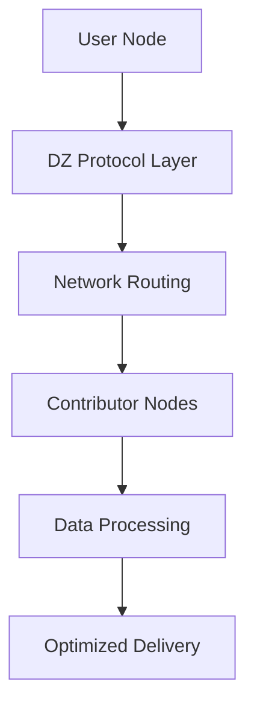

# Architecture

The DoubleZero network is built on a sophisticated architecture designed for high-performance, decentralized network operations optimized for blockchain and distributed systems.

## Network Overview

DoubleZero creates a global mesh network that interconnects contributors and users through optimized routing and data processing infrastructure.

## Core Components

### 1. Network Nodes

**Contributor Nodes**
- Provide network capacity and infrastructure
- Run DZ Protocol software
- Participate in network routing decisions
- Earn rewards for contribution

**User Nodes**
- Connect to consume network services
- Integrate with blockchain systems
- Benefit from optimized data transmission
- Pay for network usage

### 2. DZ Protocol

The DoubleZero Protocol is the core communication layer:

**Protocol Features**
- **Version**: DZ Protocol v1.0
- **Transport**: TCP/UDP with custom extensions
- **Security**: TLS 1.3 encryption
- **Authentication**: Public key verification
- **Routing**: Dynamic mesh network routing

### 3. Network Infrastructure

#### Backbone Network
- High-speed fiber connections
- Redundant routing paths
- Geographic distribution
- Load balancing capabilities

#### Edge Processing
- FPGA-based data filtering
- Spam and duplicate removal
- Transaction preprocessing
- Performance optimization

## Data Flow

### Inbound Processing

1. **Data Reception**: Network receives blockchain data
2. **Edge Filtering**: Remove spam and duplicates at hardware level
3. **Routing**: Optimize path through network backbone
4. **Delivery**: Transmit filtered data to user nodes

### Outbound Processing

1. **User Request**: Blockchain node sends transaction
2. **Network Optimization**: Route through optimized paths
3. **Priority Handling**: Apply network-level prioritization
4. **Transmission**: Deliver with reduced latency and jitter

## Performance Optimizations

### Latency Reduction
- **Direct routing**: Bypass congested internet routes
- **Edge processing**: Reduce data processing overhead
- **Protocol optimization**: Minimize protocol overhead

### Throughput Enhancement
- **Parallel processing**: Multiple data streams
- **Load distribution**: Balance across network capacity
- **Buffer optimization**: Optimize for blockchain data patterns

### Reliability Improvements
- **Redundant paths**: Multiple routing options
- **Failover mechanisms**: Automatic path switching
- **Health monitoring**: Continuous network assessment

## Security Architecture

### Authentication
- Public key verification
- Network admission control
- Continuous identity validation

### Encryption
- End-to-end TLS 1.3
- Secure key exchange
- Encrypted data transmission

### Access Control
- Role-based permissions
- Network segmentation
- Audit logging

## Scalability Design

### Horizontal Scaling
- Add contributor nodes
- Expand geographic coverage
- Increase network capacity

### Vertical Scaling
- Upgrade existing infrastructure
- Optimize protocol efficiency
- Enhance processing capabilities

## Network Topology

The DoubleZero network forms a dynamic mesh topology:

- **Hub-and-spoke**: Central routing with distributed access
- **Full mesh**: Direct connections between major nodes
- **Hybrid**: Combination of both approaches

## Monitoring and Management

### Network Health
- Real-time performance metrics
- Automated alerting
- Performance analytics

### Capacity Management
- Dynamic load balancing
- Predictive scaling
- Resource optimization

## Future Evolution

The architecture is designed for:
- **Protocol upgrades**: Seamless version transitions
- **Feature additions**: New capabilities without disruption
- **Scale expansion**: Growing network requirements
- **Technology integration**: Emerging network technologies 